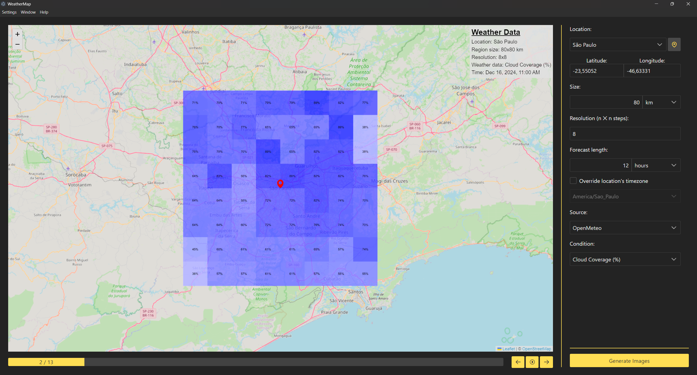

## What is this project about?
Designed for astronomy and astrophotography enthusiasts, this project visualizes precise weather conditions across selected regions, aiding in the planning of ideal observational activities.

 

## Project Screenshot

 

## Features
Visualize weather data
Choose between different data sources
Check the weather conditions at different locations

 

## How to run this project
There are two ways to run this project:

Install it using the installer  
or  
Build it yourself from the code in this repository  

> If you want to run the program under Linux and it doesn't start, try running it with the `no-sandbox` parameter. The full command would then `./path/to/WeatherMap.AppImage --no-sandbox` if you use the AppImage, or `weather-map --no-sandbox` if you installed the `.deb` file.

 

### If you want to run the project locally, follow these steps:
Download the latest installer from the <a href="https://github.com/kgabriel-dev/WeatherMap/releases">releases page</a>  
Run the installer and follow the installation instructions  
Open the installed application

 

### To build the project from this repository, follow these steps:
Make sure you have <a href="https://nodejs.org/en/download/">Node.js</a> installed at version 20.18 or higher  
Clone this repository using `git clone https://github.com/kgabriel-dev/WeatherMap.git`  
Navigate to the project directory using `cd WeatherMap`  
Install the project dependencies using `npm install`  
Run the project using `npm run electron`  

 

## How to contribute?
Contributions are always welcome! Feel free to open an issue on <a href="https://github.com/kgabriel-dev/WeatherMap/issues">the issues page</a> or submit a pull request if you have any suggestions or improvements to this project.

